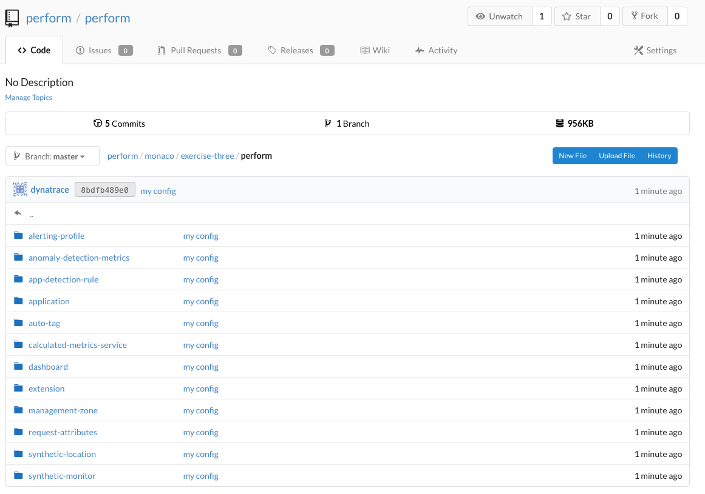

## Monaco HOT - Exercise Two

In this exercise we will show you how you can use Monaco to download an existing environment's configuration. This is particularely handy if you already have a lot of configuration that you want to use to start storing it in a repository, or if you want to have some sample configuration.

### Step 1 - Create an environments.yaml file
The first step is, like with **exercise-one**, is to create an `environments.yaml` file.
Using gitea, navigage to `monaco/exercise-three` and open the `environments.yaml` file.

Fill in the file as follows, or copy the contents of the `environments.yaml` file stored in `monaco/exercise-one`. Make sure to replace `YOUR_ENV_URL` with your Dynatrace environment URL.

```yaml
perform:
  - name: "perform"
  - env-url: "YOUR_ENV_URL" 
  - env-token-name: "DT_API_TOKEN" 
```

Commit this file.

### Step 2 - Download configuration

Open your ssh client and connect to the virtual machine that was provided to you, either via the web shell or via a dedicated ssh client.

Go to the perform folder in your home directory:
```bash
cd ~/perform
```

Update the locally stored repo:
```bash
git pull
```
**Note:** You might need to execute this using `sudo`

Go to the exercise folder
```bash
cd monaco/exercise-three
```

Set your Dynatrace API token as an environment variable (verify that it is no longer set from a previous exercise first):

```bash
export DT_API_TOKEN=$(kubectl -n dynatrace get secret oneagent -o jsonpath='{.data.apiToken}' | base64 -d)
echo $DT_API_TOKEN
```

We will use the new experimental CLI that will allow us to download the Monaco config. We can activate it by supplying the environment variable `NEW_CLI=true` to the command. Execute the following command to get an overview of the options:
```bash
NEW_CLI=true monaco

You are using the new CLI structure which is currently in Beta.

Please provide feedback here:
  https://github.com/dynatrace-oss/dynatrace-monitoring-as-code/issues/45.

We plan to make this CLI GA in version 2.0.0

2021-01-26 19:29:00 INFO  Dynatrace Monitoring as Code v1.2.0
NAME:
   monaco - Automates the deployment of Dynatrace Monitoring Configuration to one or multiple Dynatrace environments.

USAGE:
   monaco [global options] command [command options] [arguments...]

VERSION:
   1.2.0

DESCRIPTION:
   Tool used to deploy dynatrace configurations via the cli
   
   Examples:
     Deploy a specific project inside a root config folder:
       monaco deploy -p='project-folder' -e='environments.yaml' projects-root-folder
   
     Deploy a specific project to a specific tenant:
       monaco deploy --environments environments.yaml --specific-environment dev --project myProject

COMMANDS:
   deploy    deployes the given environment
   download  download the given environment
   help, h   Shows a list of commands or help for one command

GLOBAL OPTIONS:
   --help, -h  show help (default: false)
   --version   print the version (default: false)
```

We now have access to a new option to download the configuration, let's try it out!

```bash
NEW_CLI=true monaco download -e=environments.yaml
```

Monaco will now download the config:
```bash
You are using the new CLI structure which is currently in Beta.

Please provide feedback here:
  https://github.com/dynatrace-oss/dynatrace-monitoring-as-code/issues/45.

We plan to make this CLI GA in version 2.0.0

2021-01-26 19:33:00 INFO  Dynatrace Monitoring as Code v1.2.0
2021-01-26 19:33:00 INFO  Creating base project name perform
2021-01-26 19:33:00 WARN  You used an old token format. Please consider switching to the new 1.205+ token format.
2021-01-26 19:33:00 WARN  More information: https://www.dynatrace.com/support/help/dynatrace-api/basics/dynatrace-api-authentication/#-dynatrace-version-1205--token-format
2021-01-26 19:33:00 INFO   --- GETTING CONFIGS for aws-credentials
2021-01-26 19:33:00 INFO  No elements for API aws-credentials
2021-01-26 19:33:00 INFO   --- GETTING CONFIGS for calculated-metrics-service
2021-01-26 19:33:00 INFO   --- GETTING CONFIGS for application
2021-01-26 19:33:01 INFO   --- GETTING CONFIGS for conditional-naming-service
2021-01-26 19:33:01 INFO  No elements for API conditional-naming-service
2021-01-26 19:33:01 INFO   --- GETTING CONFIGS for request-attributes
2021-01-26 19:33:01 INFO   --- GETTING CONFIGS for alerting-profile
2021-01-26 19:33:01 INFO   --- GETTING CONFIGS for synthetic-location
2021-01-26 19:33:02 INFO   --- GETTING CONFIGS for azure-credentials
2021-01-26 19:33:02 INFO  No elements for API azure-credentials
2021-01-26 19:33:02 INFO   --- GETTING CONFIGS for maintenance-window
2021-01-26 19:33:02 INFO  No elements for API maintenance-window
2021-01-26 19:33:02 INFO   --- GETTING CONFIGS for auto-tag
2021-01-26 19:33:03 INFO   --- GETTING CONFIGS for management-zone
2021-01-26 19:33:03 INFO   --- GETTING CONFIGS for dashboard
2021-01-26 19:33:04 INFO   --- GETTING CONFIGS for app-detection-rule
2021-01-26 19:33:04 INFO   --- GETTING CONFIGS for conditional-naming-processgroup
2021-01-26 19:33:04 INFO  No elements for API conditional-naming-processgroup
2021-01-26 19:33:04 INFO   --- GETTING CONFIGS for kubernetes-credentials
2021-01-26 19:33:05 INFO  No elements for API kubernetes-credentials
2021-01-26 19:33:05 INFO   --- GETTING CONFIGS for synthetic-monitor
2021-01-26 19:33:05 INFO   --- GETTING CONFIGS for calculated-metrics-log
2021-01-26 19:33:05 INFO  No elements for API calculated-metrics-log
2021-01-26 19:33:05 INFO   --- GETTING CONFIGS for request-naming-service
2021-01-26 19:33:05 INFO  No elements for API request-naming-service
2021-01-26 19:33:05 INFO   --- GETTING CONFIGS for custom-service-java
2021-01-26 19:33:05 INFO  No elements for API custom-service-java
2021-01-26 19:33:05 INFO   --- GETTING CONFIGS for extension
2021-01-26 19:33:08 INFO   --- GETTING CONFIGS for conditional-naming-host
2021-01-26 19:33:08 INFO  No elements for API conditional-naming-host
2021-01-26 19:33:08 INFO   --- GETTING CONFIGS for notification
2021-01-26 19:33:08 INFO  No elements for API notification
2021-01-26 19:33:08 INFO   --- GETTING CONFIGS for anomaly-detection-metrics
2021-01-26 19:33:11 INFO  END downloading info perform
```

We can now push this content back to our git repository:

```bash
git add .
git commit -m "my config"
git push
```

Check out in gitea the now uploaded Dynatrace config! GitOps is yet another step closer!


This concludes the exercise.