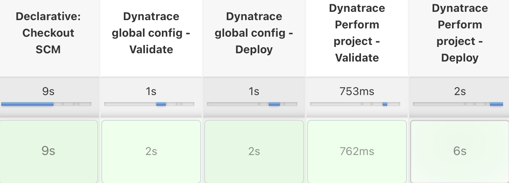
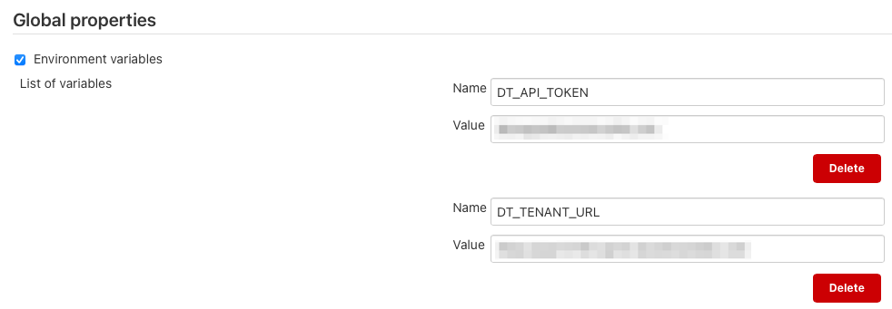
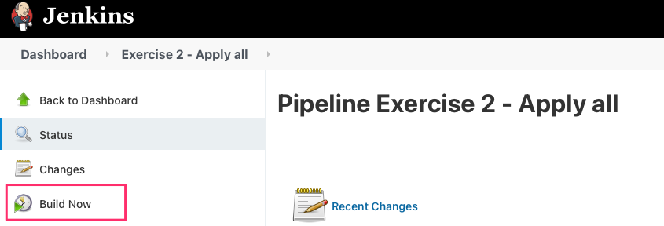
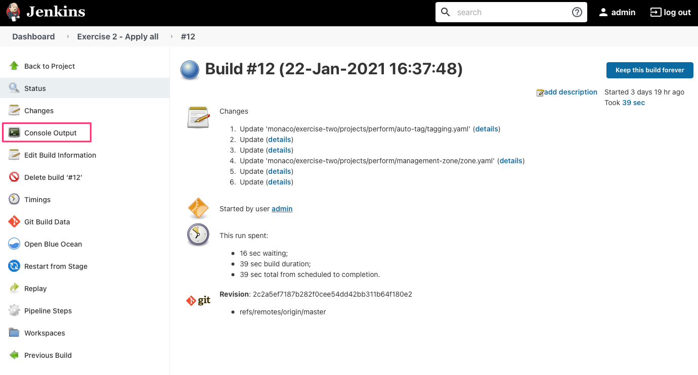
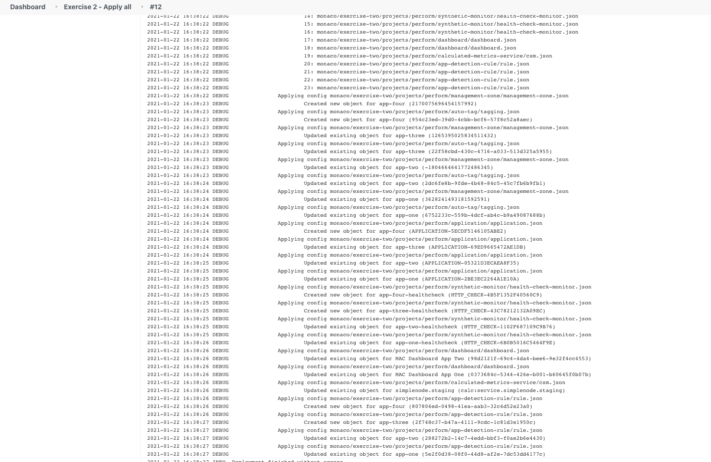

# Monaco HOT - Exercise Two
During this exercise we will apply a large amount of configuration to our Dynatrace environment using a Jenkins pipeline:



The pipeline is divided in two projects:
1. A **Global** project that contains cluster wide configurations:  
   - Auto tagging rules
   - Request attributes
   - Synthetic locations
1. A **Perform** project that contains the configuration specifically for our project:
    - Application definition
    - Application detection rules
    - Auto tagging rules
    - Calculated services metrics
    - Dashboards
    - Management zones
    - Synthetic monitors

## Step 1 - Explore configuration
### Folder structure
Using gitea, explore the contents of the `monaco/project-two` folder. It looks like this:
```
|-- environments.yaml
`-- projects
    |-- global
    |   |-- auto-tag
    |   |   |-- auto-tag.json
    |   |   `-- auto-tag.yaml
    |   |-- request-attributes
    |   |   |-- request-attribute.json
    |   |   `-- request-attribute.yaml
    |   `-- synthetic-location
    |       |-- private-synthetic.json
    |       `-- synthetic-location.yaml
    `-- perform
        |-- app-detection-rule
        |   |-- rule.json
        |   `-- rules.yaml
        |-- application
        |   |-- application.json
        |   `-- application.yaml
        |-- auto-tag
        |   |-- tagging.json
        |   `-- tagging.yaml
        |-- calculated-metrics-service
        |   |-- csm.json
        |   `-- csm.yaml
        |-- dashboard
        |   |-- dashboard.json
        |   `-- dashboard.yaml
        |-- management-zone
        |   |-- management-zone.json
        |   `-- zone.yaml
        `-- synthetic-monitor
            |-- health-check-monitor.json
            `-- synthetic-monitors.yaml
```
### Configurations
Navigate, in gitea, the contents of `monaco/project-two`, and see which configurations will be applied automatically.

### Jenkins pipeline
Using gitea, open the file [jenkins/exercise-two.Jenkinsfile](../../jenkins/exercise-two.Jenkinsfile)
```groovy
ENVS_FILE = "monaco/exercise-two/environments.yaml"

pipeline {
    agent {
        label 'monaco-runner'
    }
    stages {
        stage('Dynatrace global config - Validate') {
			steps {
                container('monaco') {
                    script{
                        sh "monaco -v -dry-run -e=$ENVS_FILE -p=global monaco/exercise-two/projects"
                    }
                }
			}
		}
        stage('Dynatrace global config - Deploy') {
			steps {
                container('monaco') {
                    script {
				        sh "monaco -v -e=$ENVS_FILE -p=global monaco/exercise-two/projects"
                        sh "sleep 60"
                    }
                }
			}
		}       
        stage('Dynatrace Perform project - Validate') {
			steps {
                container('monaco') {
                    script{
                        sh "monaco -v -dry-run -e=$ENVS_FILE -p=perform monaco/exercise-two/projects"
                    }
                }
			}
		}
        stage('Dynatrace Perform project - Deploy') {
			steps {
                container('monaco') {
                    script {
				        sh "monaco -v -e=$ENVS_FILE -p=perform monaco/exercise-two/projects"
                    }
                }
			}
		}       
    }
}
```
A few important sections are noted:
### The monaco-runner
```groovy
agent {
    label 'monaco-runner'
}
```
```groovy
...
container('monaco')
...
```
This section refers to the `monaco-runner`, a container that was precreated by the Dynatrace ACE services team that can be used within a CI/CD pipeline.
Within the `monaco` container, we now have the `monaco` CLI available. For more information, visit https://github.com/dynatrace-ace/monaco-runner.

Go to **Manage Jenkins** >> **Configure System** >> **Cloud configuration page** (bottom of settings page) >> **Pod Templates** >> **Pod Template monaco-runner** >> **Pod Template details...** and look at the configuration.
.

By using this pod template in our Jenkins pipeline, we make the `monaco` command from within the pod available within our pipeline.

### The environments.yaml file
On the first line of the Jenkinsfile we find the following:
```
ENVS_FILE = "monaco/exercise-two/environments.yaml"
```
This file looks like this (you can verify this using Gitea):
```yaml
perform:
  - name: "perform"
  - env-url: "{{ .Env.DT_TENANT_URL }}" 
  - env-token-name: "DT_API_TOKEN" 
```
We defined a Dynatrace environment for Monaco to handle called `perform`.
The attributes `env-url` and `env-token-name` contain the names of **environment variable** that contain the environment url and API token respectively. Note the difference in notation. Within Monaco it is possible to use environment variables anywhere, by using the format `{{ .Env.YOUR_ENV_VAR_NAME }}`. For the token, it is slightly different as this was historically always the name of an environment variable, so here you just put the format `YOUR_ENV_VAR_NAME` to load your token.

So the question is: **Where are those variables stored?**

Jenkins always passes all environment variables that are defined in its system to all the pipelines that are running. If we open **Manage Jenkins** >> **Configure System** and we scroll down a bit we see all the environment variables that are defined, including the Dynatrace Environment URL and Dynatrace API Tokens:
.

Monaco, when running, will load and replace all environment variables where it can. If an environment variable is not set, it will throw a validation error.

### Dry-run vs deploy
For each project, notice there are two stages:
```groovy
stage('Dynatrace global config - Validate') {
    steps {
        container('monaco') {
            script{
                sh "monaco -v -dry-run -e=$ENVS_FILE -p=global monaco/exercise-two/projects"
            }
        }
    }
}
stage('Dynatrace global config - Deploy') {
    steps {
        container('monaco') {
            script {
                sh "monaco -v -e=$ENVS_FILE -p=global monaco/exercise-two/projects"
                sh "sleep 60"
            }
        }
    }
}       
```

For the first stage, we add an extra argument, `-dry-run`, which will only validate the structure of our project (and dependant projects). It is similar to a `terraform plan`.

## Step 2 - Trigger pipeline
Once we are familiar with the project structure and the contents, it is time to trigger our pipeline.

Navigate to the **Jenkins Dashboard**, open the pipeline **Exercise 2 - Apply all**, and click on **Build Now**.



The pipeline will now run and apply the two Monaco projects - **Global** and **Perform** - to the Dynatrace Environment.

Wait until the pipeline has finished, you will be able to see it if all stages completed succesfully:


Click on the build number, in the screenshot above it will be **#12**, this brings you to the build details. Click on **Console Output**



In the **Console Output** you can track the progress and changes that Monaco made.



## Step 3 - View results in Dynatrace

As a last step, go to your Dynatrace environment and verify that Monaco created all the configurations as described in the two Monaco projects.

## Step 4 - Change configuration and re-apply

Take one of the configuration items that were created and make a change in the JSON file (apart from the name!). Re-run the pipeline and see the changes taking effect in Dynatrace.

That concludes this lab.